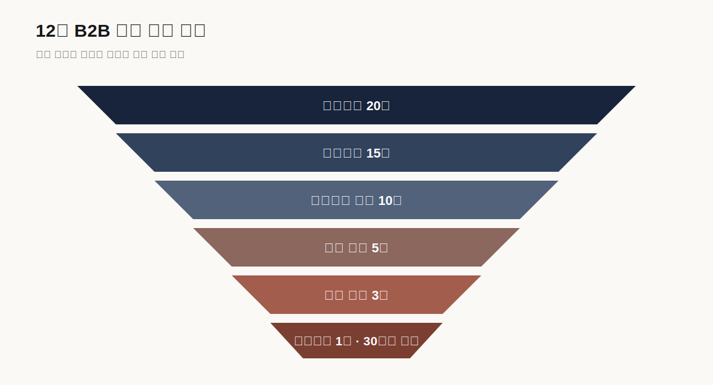

# 개항장 B2B 로컬기프트 12주 WBS

**목표:** 상점 5곳의 상품으로 표준키트 1종을 만들고 잠재고객 20곳에 영업해 30세트 이상 유료발주 1건을 납품한다.

## 1. 역할

| 역할 | 책임 |
|---|---|
| PM·영업 | 범위·예산·고객목록·미팅·견적·계약 |
| 소싱·파트너십 | 상점 조사·공급조건·동의·정산 |
| 상품·콘텐츠 | 구성·포장·이야기카드·카탈로그 |
| 운영·품질 | 조달·입고검수·포장·출고·배송 |
| 웹·데이터 | QR·CRM·견적·주문·KPI 데이터 |

## 2. 상세 WBS

| ID | 작업 | 기간 | 담당 | 선행 | 완료기준 |
|---|---|---|---|---|---|
| 1.1 | 목표·KPI·예산 기준선 | 1주 | PM | - | 승인된 1쪽 기준선 |
| 1.2 | 주간회의·변경·위험관리 | 1~12주 | PM | 1.1 | 결정·지연·범위 기록 |
| 2.1 | 상점 조사표·선정기준 | 1주 | 소싱 | 1.1 | 지역성·품질·공급 평가표 |
| 2.2 | 후보 15곳 조사 | 1~2주 | 소싱 | 2.1 | 위치·상품·권리·운영상태 |
| 2.3 | 상점 10곳 접촉·7곳 면담 | 2~3주 | 소싱 | 2.2 | 공급가·수량·리드타임 확인 |
| 2.4 | 상점 5곳 선정·동의 | 3주 | PM·소싱 | 2.3 | 서면 공급·콘텐츠 동의 |
| 2.5 | 공급·대체상품표 | 3~4주 | 소싱·운영 | 2.4 | MOQ·유통기한·대체조건 |
| 3.1 | 구매자 세그먼트·목록 20곳 | 1~2주 | 영업 | 1.1 | 담당부서·연락처·행사시점 |
| 3.2 | 구매담당 인터뷰 5건 | 2~3주 | 영업·연구 | 3.1 | 예산·수량·납기·대안 기록 |
| 3.3 | 문제·가격 가설 수정 | 3주 | PM | 3.2 | 인터뷰 기반 변경기록 |
| 4.1 | 표준키트 구성안 | 3~4주 | 상품 | 2.4, 3.3 | 기본 80%·맞춤 20% |
| 4.2 | 원가·공헌이익 계산 | 4주 | PM·운영 | 2.5, 4.1 | 30·50·100세트 원가표 |
| 4.3 | 표시·권리·포장 검토 | 4~5주 | 운영·콘텐츠 | 4.1 | 제조·원산지·IP 체크 |
| 4.4 | 샘플 5세트 제작 | 5주 | 상품·운영 | 4.2, 4.3 | 배포 가능한 실물 5세트 |
| 4.5 | 이야기카드·QR | 4~5주 | 콘텐츠·웹 | 2.4 | 출처·상인검수·수정채널 |
| 5.1 | 1쪽 카탈로그 | 5주 | 상품·영업 | 4.4 | 구성·가격·납기·옵션 명시 |
| 5.2 | 30·50·100세트 견적서 | 5주 | PM·영업 | 4.2 | 포함·제외·유효기간 명시 |
| 5.3 | 발주·취소·대체·환불 조건 | 5~6주 | PM·운영 | 4.3 | 고객·상점 책임 구분 |
| 5.4 | CRM·영업기록 | 5~6주 | 웹·영업 | 3.1 | 접촉–미팅–견적–발주 상태 |
| 6.1 | 잠재고객 20곳 1차 접촉 | 6~7주 | 영업 | 5.1, 5.2 | 15곳 유효접촉 |
| 6.2 | 구매담당 미팅 10건 | 7~9주 | 영업 | 6.1 | 회의록·다음 행동 |
| 6.3 | 샘플 전달 5건 | 7~9주 | 영업 | 4.4, 6.2 | 수령·피드백 확인 |
| 6.4 | 공식 견적 3건 | 8~10주 | 영업·PM | 6.2 | 행사일·예산·수량 포함 |
| 6.5 | 유료발주 1건 확보 | 9~10주 | PM | 6.4 | 발주서 또는 예약금 |
| 7.1 | 상점별 조달 확정 | 10주 | 운영 | 6.5 | 수량·납기 재확인 |
| 7.2 | 입고·품질·표시 검수 | 10~11주 | 운영 | 7.1 | 불량·수량·유통기한 기록 |
| 7.3 | 포장·출고검수 | 11주 | 운영 | 7.2 | 30세트 이상 누락 0 |
| 7.4 | 고객납품·인수확인 | 11주 | 운영 | 7.3 | 납기준수·인수증 |
| 7.5 | 상점정산 | 11주 | PM·운영 | 7.4 | 계약기준 전액정산 |
| 8.1 | 구매기관·상점 사후면담 | 11~12주 | 영업·소싱 | 7.4 | 재구매·부담·개선점 |
| 8.2 | 공헌이익·작업시간 계산 | 12주 | PM | 7.5 | 실제 손익표 |
| 8.3 | 사업·사회성과 분석 | 12주 | PM·데이터 | 8.1, 8.2 | 분모·증빙 포함 KPI |
| 8.4 | 계속·수정·중단 결정 | 12주 | 전원 | 8.3 | 다음 3개월 행동 |
| 8.5 | 지원사업 증거팩 | 12주 | PM | 8.4 | 동의·견적·발주·납품·정산 |

## 3. 간트 요약

퍼널 수치는 실제 성과가 아니라 12주 검증 목표다.

| 작업 | 1 | 2 | 3 | 4 | 5 | 6 | 7 | 8 | 9 | 10 | 11 | 12 |
|---|:---:|:---:|:---:|:---:|:---:|:---:|:---:|:---:|:---:|:---:|:---:|:---:|
| 관리 | ● | ● | ● | ● | ● | ● | ● | ● | ● | ● | ● | ● |
| 상점 소싱 | ● | ● | ● | ● |  |  |  |  |  |  |  |  |
| 구매자 조사 | ● | ● | ● |  |  |  |  |  |  |  |  |  |
| 상품·원가·샘플 |  |  | ● | ● | ● |  |  |  |  |  |  |  |
| 영업도구 |  |  |  |  | ● | ● |  |  |  |  |  |  |
| B2B 영업 |  |  |  |  |  | ● | ● | ● | ● | ● |  |  |
| 조달·납품 |  |  |  |  |  |  |  |  |  | ● | ● |  |
| 평가 |  |  |  |  |  |  |  |  |  |  | ● | ● |

## 4. 승인 게이트

| 시점 | 게이트 | 통과조건 | 미통과 시 조치 |
|---|---|---|---|
| 3주 | G1 문제·공급 | 담당자 인터뷰 5건, 상점 5곳 후보 | 상품 제작 전 문제·공급 재조사 |
| 5주 | G2 샘플 | 원가표·표시검수·샘플 5세트 | 마진 음수면 구성·가격 수정 |
| 7주 | G3 영업개시 | 카탈로그·견적·계약·CRM | 문서 미완료면 샘플 대량배포 금지 |
| 10주 | G4 발주 | 견적 3건·유료발주 1건 | 발주 없으면 재고조달 금지 |
| 11주 | G5 납품 | 30세트 이상·납기·오류 0 | 원인·비용 기록 후 추가주문 중단 |
| 12주 | G6 사업판단 | 손익·재구매·상점 반복공급 | 계속·수정·중단 결정 |

## 5. 최종 판단기준

- **계속:** 견적 3건, 30세트 이상 유료납품, 공헌이익 양수, 상점 3곳 반복공급
- **수정:** 발주는 있으나 마진·납기·맞춤업무 중 하나가 기준미달
- **중단·재정의:** 20곳 영업 후 견적이 없거나 30세트 기준 손실

목표 미달 데이터를 숨기거나 추가 모집으로 분모를 바꾸지 않는다.

## 6. 지원사업 적합성

현재 사업은 기술 R&D보다 지역상품 소싱, 패키지 표준화, B2B 영업과 첫 납품 검증이 필요하다.

| 순위 | 제도 | 적합도 | 활용목적 |
|---:|---|---:|---|
| 1 | 인천 관광스타트업 | 5/5 | 로컬IP·관광기념품·지역특화 상품화 |
| 2 | 예비관광벤처 | 5/5* | 샘플·시장검증·관광상품 사업화 |
| 3 | 로컬크리에이터 | 5/5 | 지역상품 공동기획·판로 |
| 4 | 관광기업지원센터 입주 | 4/5* | 공간·관광·MICE 네트워크 |
| 5 | 인천콘텐츠코리아랩 | 3/5* | 이야기카드·브랜드 IP |
| 6 | 예비창업패키지 | 3/5* | 범용 상품·영업 MVP |
| 7 | TIPS | 1/5 | 현재 단계에는 부적합 |

`*` 사업자등록·업력·소재지 등 신청자 조건에 따라 달라진다.

### 신청 전 필수증거

- 상점 5곳의 공급·콘텐츠 동의
- 공급가·MOQ·리드타임·표시사항
- 표준키트 샘플 5세트
- 구매담당자 인터뷰와 고객 20곳 영업기록
- 공식 견적요청 3건
- 30세트 이상 유료발주·납품·정산
- 실제 공헌이익과 상점별 정상가격 매입액

### TIPS 판단

로컬기프트 기획·포장·납품은 기술적 불확실성을 해결하는 R&D가 아니다. QR·CRM·AI 추천을 추가해도 TIPS 적합성이 생기지 않는다. 여러 지역의 공급·권리·품질을 처리하는 독립 B2B 소프트웨어가 유료로 사용되고 민간 운영사 투자를 받을 단계에서만 재검토한다.

### 지원사업 공식자료

1. 인천광역시·인천관광공사(2026), [인천 관광스타트업](https://www.incheon.go.kr/IC010205/view?curPage=1&repSeq=DOM_0000000014270239)
2. 한국관광공사(2026), [제18회 예비관광벤처](https://touraz.kr/announcementList/pssrpView?curPage=1&pssrpSeqEnc=AFW1uSgdS4Ajj%2AZQp7UAJw%3D%3D)
3. 중소벤처기업부(2025), [로컬크리에이터 제도 참고 PDF](https://www.mss.go.kr/common/board/Download.do?bcIdx=1056422&cbIdx=160&streFileNm=33a98df6-d9e4-4096-801c-e3bf61b88ff4.pdf)
4. 인천관광공사(2026), [관광기업지원센터 입주기업](https://www.ito.or.kr/main/bbs/bbsMsgDetail.do?bcd=notice&cate1=02&msg_seq=1013&pgno=26)
5. TIPS, [프로그램 개요](https://www.jointips.or.kr/about.php)
