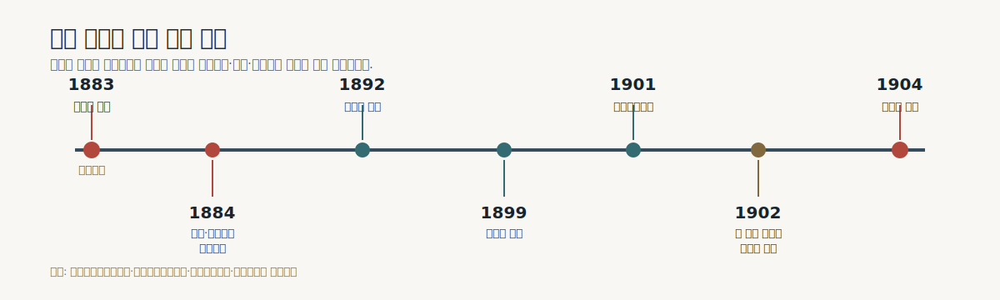
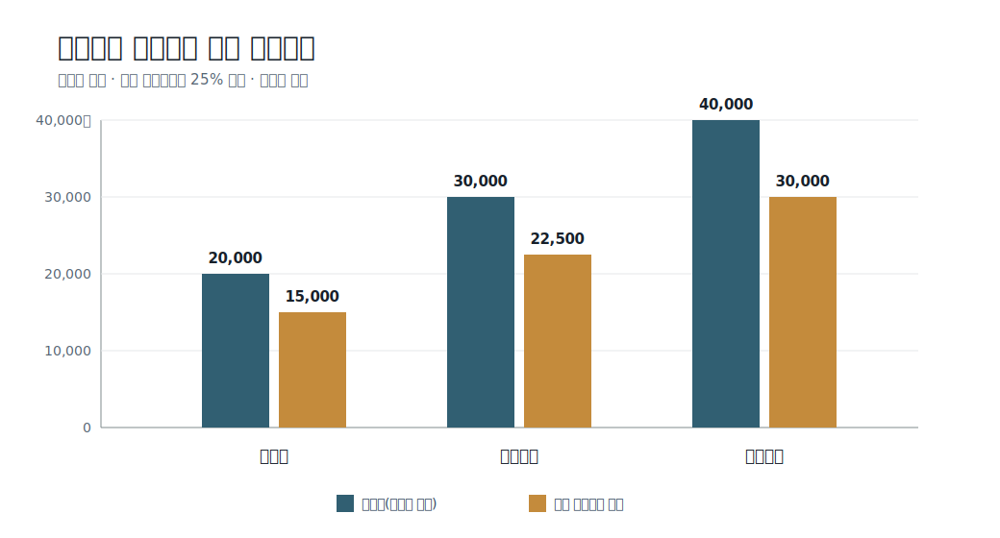

# 인천 개항장 지역자산을 활용한 B2B 로컬기프트 스타트업 사업모형 연구

## 지역 소상공인 상품의 공동기획·표준화·단체납품을 중심으로

**기준일:** 2026년 7월 15일

**초기 실증지역:** 인천 개항장 문화지구와 신포시장 도보권

**가칭:** 개항장 발견상점

## 초록

인천 개항장은 근현대문화유산과 음식·인쇄·항만·이주문화, 현재 영업하는 소규모 상점과 공방이 중첩된 지역이다. 인천연구원은 문화유산의 소유·운영주체가 분산되어 연계 활용이 제한되고, 장소성 스토리텔링을 위한 체계적 조사가 부족하다고 진단한다[1][2]. 인천 정책로드맵 2040은 주민·상인 참여와 개항장의 정체성을 반영한 음식·기념품·아트상품 개발을 과제로 제시한다[3].

관광기념품 선행연구는 지역문화 표현만으로 상품성이 완성되지 않음을 보여준다. 체계적 문헌고찰은 상품·사회문화효과·사업생태계·구매행동·만족을 별도 연구축으로 구분하며[9], 국내 연구는 색상·실용성·품질·휴대와 보관 편의를 구매 고려요인으로 제시한다[10]. 따라서 본 사업은 ‘개항장 이미지 부착’이 아니라 지역표지, 현대적 사용성, 품질과 납품조건을 함께 검증한다.

본 연구는 문제를 관광정보 부족이나 방문객 부족으로 규정하지 않는다. 해결할 문제는 두 시장 사이의 거래비용이다. 기업·행사·숙박 운영자는 인천다운 단체 선물을 필요로 하더라도 여러 소상공인의 상품을 직접 발굴하고, 공급량·표시사항·포장·납기·정산을 통합하기 어렵다. 반대로 개항장의 작은 상점은 B2B 영업, 공동패키지, 대량납품과 지역성 콘텐츠 제작 역량이 부족할 수 있다. 다만 이 문제는 아직 구매기관 인터뷰와 유료발주로 검증되지 않았으므로 사업가설로 취급한다.

제안하는 스타트업은 개항장 상점의 기존 상품을 발굴하고, 검증된 지역 이야기와 표준 패키지를 결합한 웰컴키트·단체 선물을 행사 운영사, 호텔, 기업, 대학과 문화기관에 공급한다. 초기 12주 동안 상점 5곳, 표준키트 1종, 샘플 5세트, 잠재고객 20곳, 미팅 10건, 견적요청 3건과 30세트 이상의 유료발주 1건을 목표로 검증한다. 모바일 웹과 QR은 독립 플랫폼이 아니라 상품의 출처·상점·개항장 방문경로를 설명하는 보조수단이다.

**주제어:** 인천 개항장, B2B 로컬기프트, MICE, 지역상품, 로컬크리에이터, 소상공인, 사회적 가치

## 사업개요

### 사업의 한 문장 정의

> ‘개항장 발견상점’은 개항장 소상공인의 기존 상품과 검증된 지역 이야기를 표준형 단체선물로 구성하여, 인천의 행사·숙박·기업·대학·문화기관에 통합 견적·포장·납품하는 B2B 로컬기프트 사업이다.

### 사업화 구조

| 구분 | 사업화 내용 |
|---|---|
| 해결할 지역문제 | 개항장에는 지역성 있는 상품과 이야기가 있지만 개별 상점 단위로 흩어져 있어 단체구매용 상품·공급조건·콘텐츠로 연결되기 어렵다는 가설 |
| 지불고객 | 행사·MICE 운영사, 소형 호텔·숙소, 기업·대학, 박물관·문화기관 |
| 공급·수혜자 | 개항장 문화지구와 신포시장 도보권의 상점·공방·소규모 생산자 |
| 최초 상품 | 상온 지역상품 2~3개, 검증된 이야기카드·QR, 표준상자와 교체형 기관 띠지로 구성한 ‘개항장 웰컴키트 01’ |
| 기준 가격 | 스탠더드 30,000원(VAT 제외)·33,000원(VAT 포함), 30세트 이상, 배송·전용 디자인 별도 |
| 고객이 사는 가치 | 여러 상점을 직접 관리하지 않고 한 번의 상담·견적·정산으로 인천다운 선물을 정해진 수량과 날짜에 받는 것 |
| 스타트업의 역할 | 상품 발굴 → 공급·표시·권리 확인 → 구성·콘텐츠·포장 표준화 → B2B 영업 → 조달·검수·납품 → 상점정산·재주문 관리 |
| 수익원 | ① 표준키트 판매마진 ② 로고·외국어·전용카드 제작비 ③ 검증 후 공동기념품 기획·제작수익 ④ 선택형 상점체험·도보콘텐츠 참가비 |
| 판매경로 | 구매담당자 직접영업, 1쪽 카탈로그와 실물샘플, 행사 운영사·호텔·대학·문화기관 제휴, MICE 네트워크 |
| 재고·현금 원칙 | 발주서 또는 예약금 확보 후 매입하며, 검증 전 완제품 대량재고와 고정 매장을 보유하지 않음 |
| 기술 범위 | 상품·공급가·견적·주문·검수·정산 CRM과 출처 QR만 사용; 소비자용 앱·AI 추천·자체결제는 제외 |
| 사회적 성과 | 참여상점 수, 상점에 지급된 정상 공급가격 매입액, 상점별 매출분포, 반복거래, 검증된 지역콘텐츠 수 |

### 상품·대금·책임의 흐름

`상점 상품·공급조건 확인 → 표준키트 설계 → 구매기관 샘플·견적 → 발주서·예약금 → 상품 조달 → 검수·포장 → 일괄 납품 → 상점 정산 → 재주문`

구매기관은 스타트업과 단일 계약·정산을 하고, 스타트업은 사전에 합의한 공급가격으로 각 상점에서 상품을 매입한다. 스타트업은 상품 자체를 모두 제조하는 회사가 아니라, 분산된 지역상품을 **단체납품 가능한 하나의 제품과 거래**로 전환하는 기획·품질관리·유통사업자다. 제조자 표시, 식품표시, 상품 하자와 콘텐츠 권리는 공급계약에서 책임범위를 명확히 한다.

### 단계별 사업화

| 단계 | 기간 | 판매·운영 목표 | 다음 단계 진입조건 |
|---|---|---|---|
| 1. 유료 실증 | 12주 | 상점 5곳, 표준키트 1종, 구매기관 20곳 접촉, 30세트 이상 첫 발주 1건 | 납기준수, 중대오류 0건, 세트당 공헌이익 양수 |
| 2. 반복판매 | 3~12개월 | 30·50·100세트 표준견적, 민간 행사·숙박 고객 확보, 분기별 구성 교체 | 재구매·소개 3곳 이상, 월별 반복매출과 공급안정성 확인 |
| 3. B2B 상품확장 | 12개월 이후 | 검증된 상점과 전용 공동상품, 호텔·행사 정기납품, 외국어 구성 | 특정 지원사업·고객·상점에 매출이 과도하게 집중되지 않음 |

온라인 플랫폼이나 상설매장은 첫 단계가 아니다. 유료발주와 반복구매가 확인된 이후에만 주문페이지, 공급자 포털 또는 상설 판매공간의 필요성을 검토한다.

### 12주 핵심 WBS와 승인 게이트

| 기간 | 작업패키지 | 핵심 산출물 | 통과조건·중단조치 |
|---|---|---|---|
| 1~3주 | 상점·구매자 조사 | 후보 15곳, 상점면담 7건, 구매담당 인터뷰 5건, 고객목록 20곳 | 상점 5곳 후보와 구체적 예산·수량·납기 문제가 없으면 상품 제작 보류 |
| 3~5주 | 상품·원가·권리 검증 | 표준구성, 30·50·100세트 원가표, 표시·IP 점검, 샘플 5세트 | 30세트 공헌이익이 음수거나 표시·권리 문제가 남으면 구성 변경 |
| 5~6주 | 영업체계 구축 | 1쪽 카탈로그, 수량별 견적서, 발주·취소·대체조건, CRM | 문서가 완성되기 전 대량 샘플 배포 금지 |
| 6~10주 | B2B 영업 | 20곳 접촉, 미팅 10건, 샘플 5건, 공식견적 3건 | 10주까지 발주서·예약금이 없으면 상품 재고 매입 금지 |
| 10~11주 | 조달·납품·정산 | 30세트 이상 입고검수·포장·인수증·상점정산 | 누락·표시 오류·납기 실패 원인과 비용 확인 전 추가 주문 중단 |
| 11~12주 | 사후평가 | 실제 손익, 작업시간, 구매자·상점 면담, 지원사업 증거팩 | 계속·수정·중단 중 하나를 문서로 결정 |

역할은 `PM·영업`, `상점 소싱`, `상품·콘텐츠`, `운영·품질`, `웹·데이터`로 나눈다. 소규모 팀에서는 한 사람이 여러 역할을 맡을 수 있지만 승인, 지출, 입고검수 기록은 구분한다. 주간회의에서 작업별 담당·선행조건·완료증빙을 갱신한다.

### 지원사업 적합성과 활용계획

| 우선순위 | 지원사업 | 현재 적합도 | 활용할 사업화 작업 | 유의사항 |
|---:|---|---:|---|---|
| 1 | 인천 관광스타트업 | 5/5 | 개항장 로컬IP, 샘플·포장, 기념품 실증, 관광·MICE 판로 | 해당연도 모집유형·소재지·업력 확인[7] |
| 2 | 예비관광벤처 | 5/5* | 구매자 인터뷰, 시제품, 유료 시장검증, 관광상품 사업화 | 사업자등록 여부와 신청자격에 따라 달라짐 |
| 3 | 로컬크리에이터 | 5/5* | 상점 공동상품, 로컬브랜드, 지역 내외 판로 | 2025 제도를 참고했으며 최신 공고·금액 재확인 필요 |
| 4 | 관광기업지원센터 입주 | 4/5* | 업무공간, 관광기업·MICE 네트워크, 상담·IR | 공간보다 실제 구매자 연결 가능성을 확인 |
| 5 | 콘텐츠·예비창업 지원 | 3/5* | 이야기카드, 패키지 디자인, 브랜드·영업 MVP | 콘텐츠 제작이 유료발주 검증을 대체하면 안 됨 |
| 6 | TIPS | 1/5 | 현재는 신청대상이 아니라 장기 비교기준 | 단체선물 기획·납품과 QR·CRM만으로 기술 R&D가 되지 않음[8] |

`*` 신청자의 사업자등록, 업력, 소재지와 모집시점에 따라 달라진다. 지원사업 선정은 사업모형의 수요를 증명하지 않으므로, 신청 전 증거를 다음 순서로 확보한다.

1. 상점 5곳의 공급·콘텐츠 사용 동의
2. 상품별 공급가·MOQ·리드타임·표시사항
3. 표준키트 샘플 5세트와 30·50·100세트 견적서
4. 구매기관 20곳 영업기록과 공식 견적요청 3건
5. 30세트 이상 유료발주·납품·상점정산
6. 실제 공헌이익, 작업시간과 상점별 정상가격 매입액

지원금은 샘플·포장 시제품, 표시·권리 검토, 초기 영업자료와 첫 유료납품의 검증비용에 우선 사용한다. 상설매장 임차, 검증 전 대량재고, 소비자 앱 개발과 근거 없는 광고비에는 우선 배정하지 않는다.

### 지원금 없이 시작하는 최소 실행안

지원사업 결과를 기다리지 않고 상점·구매자 인터뷰, 스프레드시트 CRM, 공급조건표, 1쪽 카탈로그와 샘플 5세트까지 진행한다. 첫 30세트 생산은 발주서와 예약금을 확보한 뒤 조달한다. 즉, 지원사업은 실행을 가속하는 수단이며 사업 시작조건이 아니다.

### 매출 시나리오와 생존조건

| 구분 | 계산 가정 | VAT 제외 매출 | 허용 변동원가¹ | 공헌이익¹ | 해석 |
|---|---|---:|---:|---:|---|
| 첫 실증 | 1건 × 30세트 × 30,000원 | 900,000원 | 675,000원 이하 | 225,000원 이상 | 수요·운영 검증용이며 인건비를 감당하는 규모가 아님 |
| 초기 반복판매 | 월 4건 × 50세트 × 30,000원 | 월 6,000,000원 | 4,500,000원 이하 | 월 1,500,000원 이상 | 대표자 인건비·영업비·디자인비를 포함하면 여전히 부족할 수 있음 |
| 성장 가설 | 월 8건 × 100세트 × 30,000원 | 월 24,000,000원 | 18,000,000원 이하 | 월 6,000,000원 이상 | 상점 공급능력, 운전자금, 포장인력과 재구매가 먼저 검증돼야 함 |

¹ 목표 공헌이익률 25%를 적용한 내부 시나리오다. 변동원가는 상품매입·포장·인쇄·결제수수료·변동 포장인건비를 포함하며 배송과 고정비는 별도다. 이는 매출예측이 아니라 사업이 어느 주문빈도에서 생존 가능한지 검증하기 위한 계산표다.

사업화의 핵심 판단은 ‘좋은 지역상품인가’만이 아니다. **30세트에서 공헌이익이 남는가, 같은 구성으로 반복 납품할 수 있는가, 구매기관이 다시 주문하는가**를 동시에 충족해야 한다. 첫 유료발주 이후에도 월 반복매출이 형성되지 않으면 상설조직이나 재고투자를 확대하지 않는다.

## 1. 서론

### 1.1 연구배경

개항장에는 이미 관광앱, 박물관, 축제, 체험과 상권이 존재한다. 따라서 또 하나의 종합 관광플랫폼을 만드는 것은 기존 공공서비스와 중복될 가능성이 크다. 초기 스타트업이 도로·주차·문화유산 소유구조를 직접 해결하는 것도 현실적이지 않다.

한편 인천시는 2024년 관내 MICE 행사가 6,827건, 참가자가 약 320만 명이었다고 발표했다[4]. 인천관광공사는 MICE 참가자 환대 서비스, 기업회의·포상관광 유치, 행사 개최지원 업무를 운영하고 있다[5]. 이 수치는 행사·방문객 시장의 존재를 보여주지만 로컬기프트 수요나 구매예산을 직접 증명하지 않는다. 따라서 발주 담당자를 대상으로 수량·예산·납기·재구매 조건을 조사해야 한다.

### 1.2 연구목적

본 연구의 목적은 개항장 소상공인의 상품을 B2B 로컬기프트로 공동기획·표준화하여 단체 구매자에게 공급하는 사업모형의 문제적합성, 경제성, 사회적 가치와 실행 가능성을 검토하는 것이다.

### 1.3 연구질문

1. 행사·숙박·기업 담당자는 인천다운 단체선물을 조달하는 과정에서 어떤 불편을 겪는가?
2. 개항장 상점 5곳은 품질과 공급량을 유지하며 반복납품할 수 있는가?
3. 표준형 로컬기프트가 30세트 이상의 유료발주를 만들 수 있는가?
4. 포장·배송·정산·영업 인건비를 포함해 지속 가능한 매출총이익이 남는가?
5. 판매가 특정 상점에만 집중되지 않고 지역상점의 정상가격 매출과 콘텐츠 자산으로 이어지는가?

### 1.4 시장 정량근거

공개통계는 인천에 단체행사와 기관 구매자에게 접근할 수 있는 시장접점이 존재함을 보여준다. 다만 행사 수, 참가자 수와 경제적 파급효과는 로컬기프트의 발주 건수·구매자 수·시장규모가 아니다.

| 지표 | 공개 수치 | 기준 | 사업상 의미와 한계 |
|---|---:|---|---|
| 인천 MICE 행사 | 6,827건 | 2024 | 행사 운영사·기관에 접근할 환경; 선물 발주 건수 아님[4] |
| MICE 참가자 | 약 320만 명 | 2024 | 단체행사 접점의 총량; 상품 구매자 수로 환산 금지[4] |
| 경제적 파급효과 | 약 1조 7천억 원 | 2024 | MICE 관련 산업 효과; 로컬기프트 시장규모 아님[4] |
| 코리아 마이스 엑스포 참가 | 약 3,000명 | 2024 | 잠재 파트너를 만날 수 있는 단일행사 사례[24] |
| 엑스포 비즈니스 상담 | 약 4,000건 | 2024 | B2B 상담 접점의 존재; 로컬기프트 상담 건수 아님[24] |
| 인천 관광스타트업 모집 | 15개사 내외 | 2026 | 지역 관광사업 지원생태계; 당사 선정 보장 아님[7] |
| 기업별 사업화자금 | 최대 3,800만 원 | 2026 | 실증재원 후보; 매출이나 투자금이 아님[7] |

그래프는 2020~2022년이 생략된 선택연도 비교이며 연속 시계열로 해석하지 않는다. 행사 증가가 로컬기프트 구매 증가를 의미하지도 않는다. 따라서 초기 시장규모는 320만 명에 키트가격을 곱하지 않고 다음과 같이 실제 영업자료로 계산한다.

> 검증 SOM = 접촉 가능한 구매기관 수 × 확인된 연간 행사횟수 × 확인된 평균 주문수량 × 실제 공급단가

12주 동안 구매기관 20곳 접촉, 미팅 10건, 견적요청 3건과 30세트 이상의 유료발주 1건을 확보해야 비로소 초기 수요가 검증된 것으로 판단한다.

## 2. 지역자산과 확인된 문제

### 2.1 활용할 지역자산

- 개항장과 차이나타운의 근현대 건축·교역·이주문화
- 신포시장의 음식문화와 소규모 제조·판매자
- 배다리·개항장의 인쇄·문학·공예 자산
- 인천역·내항·상상플랫폼을 잇는 항만도시 서사
- 독립상점·공방의 기존 상품과 생산기술
- 인천의 MICE·호텔·대학·기업·문화기관 수요처

### 2.2 문헌으로 확인된 문제

| 문제 | 근거 | 사업상 해석 |
|---|---|---|
| 문화유산 운영주체 분산 | 인천연구원[1] | 스타트업은 시설 통합 대신 상품·서사·판매 연결을 담당 |
| 체계적 장소서사 조사 부족 | 인천연구원[2] | 상품카드의 역사주장을 출처와 상인 검수로 관리 |
| 주민·상인 참여와 시그니처 상품 필요 | 정책로드맵 2040[3] | 기존 상품을 활용한 소량 공동상품부터 검증 |
| 관광상품·굿즈의 상시 판매와 판로 필요 | 인천 관광 팝업 모집[6] | 공급 지속성·판매 가능성·IP 권리 확인 필요 |

### 2.3 검증되지 않은 시장문제

다음은 사실로 단정하지 않는다.

- 행사 담당자가 인천다운 선물을 찾지 못한다.
- 여러 소상공인과의 개별거래가 실제로 큰 부담이다.
- 기관의 일반적인 선물예산이 제안가격과 맞는다.
- 지역 이야기가 구매결정과 재주문을 높인다.
- 상점이 30~100세트 주문을 안정적으로 공급할 수 있다.

이 다섯 문장은 구매담당자 인터뷰, 실제 견적요청과 유료발주로 검증한다.

### 2.4 개항장의 역사적 맥락

인천 개항장은 ‘오래된 서양식 건물이 모인 거리’가 아니라 개항, 조계, 무역과 금융, 철도, 이주와 전쟁이 한 공간에 겹친 장소다. 인천시립박물관은 인천이 강화도조약 이후 1883년에 개항했다고 설명한다[14]. 인천시 공식자료 가운데 개항일을 1883년 1월 1일로 쓰는 자료가 있는 반면 실질 개항일에 관한 다른 추정도 소개되어 있으므로[23], 상품 본문에는 검증이 안정적인 ‘1883년 제물포 개항’을 기본 표기로 사용한다.

| 시기 | 확인된 역사적 사실 | 현재 남은 의미 | 상품·콘텐츠 적용 |
|---|---|---|---|
| 1883 | 제물포가 개항했고 일본조계가 설정됨[14][15] | 항구도시 전환의 시작이자 강제개항의 결과 | `1883`과 항로 모티프를 쓰되 ‘자발적 국제도시 탄생’으로 미화하지 않음 |
| 1884 | 청국조계와 여러 국적이 거주할 수 있는 각국조계가 설정됨[15] | 오늘날 경계계단·조계지 공간구조의 배경 | 경계선·지도 그래픽에 사용하고 조계의 제국주의적 성격을 함께 설명 |
| 1884 | 독일계 무역상사 세창양행이 중앙동에 설립됨[16] | 개항기 국제무역과 초기 상품상표의 사례 | 옛 상표·포장 연구에 활용하되 유물 이미지의 이용조건 확인 |
| 1892~1900 | 전환국이 인천 전동으로 옮겨 다섯 종류의 주화를 주조함[17] | 항만물류와 근대 화폐제도의 연결 | 동전 그래픽 후보로 쓰되 복제품처럼 오인되지 않게 표시 |
| 1899 | 경인선이 개통함[18] | 항구와 수도를 잇는 사람·물자의 이동축 | 승차권·노선도 형식의 이야기카드와 QR 보행코스 |
| 1901 | 외국인 사교시설인 제물포구락부가 완공됨[19] | 각국조계의 외교·교류 공간이자 현존 건축유산 | 실루엣 활용 전 국가유산 정보와 관리주체 확인 |
| 1902 | 첫 공식 하와이 이민단 121명이 12월 22일 제물포에서 출발함[20] | 인천이 한국 이민사의 출발지였음을 보여줌 | 편지 형식 콘텐츠; 이주자의 곤궁과 긴 여정을 낭만화하지 않음 |
| 1904 | 러일전쟁 초기에 제물포 해전이 일어남[21] | 개항장이 제국주의 국가 간 충돌의 현장이었음 | 전쟁 굿즈로 소비하지 않고 교육형 해설에 한정 |

인천시립박물관이 공개한 1883~1945년 근대지도 자료는 조계·항만·매립과 시가지 변화를 공간적으로 검증할 수 있는 핵심 사료다[22]. 지도와 유물 이미지를 패키지에 직접 사용할 때에는 공공누리 유형, 저작권과 2차적 저작물 작성 가능 여부를 자료별로 다시 확인한다.

### 2.5 역사 콘텐츠 작성 원칙

1. 역사 문장마다 출처기관·자료명·확인일을 기록한다.
2. ‘최초’, ‘유일’, ‘원형 그대로’는 공식 근거가 있을 때만 사용한다.
3. 개항을 근대화의 출발로만 미화하지 않고 강제개항·조계·외세 침탈과 조선인의 삶을 함께 설명한다.
4. 일본풍 복고 이미지로 개항장 전체를 대표하지 않고 청국조계, 각국조계, 조선인 상권, 노동과 이주를 균형 있게 다룬다.
5. 전쟁·이민·식민지 경험은 오락적 상품화보다 교육적 해설과 당사자 존중을 우선한다.
6. 상인·박물관·지역연구자의 검수를 거친 뒤 QR 콘텐츠를 공개하고 수정이력을 남긴다.

## 3. 문제정의와 소셜미션

### 3.1 양면 고객 문제

**구매기관:** 행사 성격과 예산에 맞는 인천 지역상품을 한 번에 주문하고 싶지만 상품 발굴, 공급 확인, 포장, 표시, 정산과 납기를 각각 관리하기 어렵다는 가설이 있다.

**지역상점:** 지역성 있는 상품이 있어도 기관 영업, 표준 견적, 공동포장, 대량납품과 콘텐츠 제작을 개별적으로 수행하기 어렵다는 가설이 있다.

### 3.2 문제정의문

> 인천의 행사·숙박·기업 담당자와 개항장 소상공인 사이에는 지역상품을 안정적인 단체선물로 전환하는 상품선정·표준화·통합납품 기능이 부족하다.

### 3.3 소셜미션

> 개항장 소상공인의 기존 상품과 검증된 지역 이야기를 B2B 로컬기프트로 공동기획하여, 지역의 정상가격 매출과 지속 가능한 거래를 만든다.

## 4. 제안 스타트업의 상세 설계

### 4.1 사업정의

> ‘개항장 발견상점’은 인천을 방문하는 기업·행사·숙박 고객을 위해 개항장 소상공인의 상품과 지역 이야기를 결합한 웰컴키트·단체선물을 기획, 포장, 납품하는 B2B 로컬기프트 스타트업이다.

### 4.2 핵심업무

1. 지역성과 공급능력이 있는 상점·상품을 발굴한다.
2. 공급가격, 최소수량, 제조·원산지, 유통기한과 권리를 확인한다.
3. 표준키트와 선택 가능한 가격대를 설계한다.
4. 출처가 표시된 이야기카드와 QR 콘텐츠를 제작한다.
5. B2B 구매자에게 샘플·견적·납기조건을 제안한다.
6. 주문을 통합해 상품을 조달·검수·포장·납품한다.
7. 상점별로 정산하고 재주문 데이터를 관리한다.

### 4.3 하지 않는 일

- 종합 관광정보·맛집·쿠폰 플랫폼
- 상점 광고비를 받고 순위를 올리는 서비스
- 검증 전 대량 재고 매입
- 모든 고객마다 처음부터 새로 만드는 무제한 기획대행
- 역사적 근거가 없는 ‘원조·최초·개항기 상품’ 홍보

## 5. 고객과 가치제안

| 우선순위 | 고객 | 사용상황 | 핵심가치 |
|---:|---|---|---|
| 1 | 행사·MICE 운영사 | 학회·기업회의·인센티브 행사 | 한 공급자에게 견적·포장·납품 통합 |
| 2 | 소형 호텔·게스트하우스 | VIP·객실·시즌 패키지 | 인천다운 소량 웰컴키트 |
| 3 | 기업·대학 | 방문단·행사·임직원 선물 | 예산별 표준구성과 증빙·정산 |
| 4 | 박물관·문화시설 | 전시·교육·기념품 | 지역사와 연결된 검증 콘텐츠 |

최종 사용자는 키트를 받는 행사 참가자와 방문객이다. 공급 파트너는 개항장 상점·공방이다. 구매기관, 최종 사용자와 공급자를 구분하여 각각 조사한다.

초기 잠재고객 20곳은 민간 행사·숙박 10곳, 기업·대학 6곳, 공공·문화기관 4곳으로 구성한다. 공공기관만을 고객으로 삼아 지원사업과 일회성 용역에 의존하지 않는다.

## 6. 최초 상품과 운영표준

### 6.1 표준형 ‘개항장 웰컴키트 01’

- 상온보관 가능한 지역 식품 또는 음료 1~2개
- 인쇄·문구·공예 소품 1개
- 출처·제조자·지역 연결을 설명하는 이야기카드
- 식품 포함 시 최소 판매단위의 법정표시를 가리지 않는 외부 슬리브와 합포장
- 상점과 개항장 방문경로를 연결하는 QR
- 고객기관 로고를 넣을 수 있는 교체형 띠지

### 6.2 가격가설

가격조사는 2026년 7월 15일 웹페이지의 표시가격을 기준으로 했다. 아래 금액은 개별 소비자가이며 실제 재고·판매가·배송조건을 보장하지 않는다. 특히 표시 소비자가를 B2B 공급가로 간주하지 않으며, 참여상점과 공급가·최소수량·납기를 별도로 협상한다.

#### 인천 로컬상품 표시가격

| 상품 | 표시 소비자가 | 키트 적용 판단 |
|---|---:|---|
| 인천 조각 스티커 | 500원 | 저가 보조물; 단독 핵심상품 부적합 |
| 인천 사진엽서 | 1,000~2,000원 | 이야기카드와 중복 여부 확인 |
| 인천개항 엽서 3종 | 1,500원 | 개항장 연계성이 직접적 |
| 인천 풍경 포토메모지 | 2,000원 | 휴대·상온보관 용이 |
| 동인천 자석버튼 | 2,500원 | 소형 표준구성 후보 |
| 인천 사각연필 | 2,500원 | 문구세트 보조상품 |
| 포디움126 젤펜 | 3,000원 | 기관 로고 인쇄 가능성 별도 확인 |
| 인천개항 편지지세트 | 4,500원 | 개항장 서사와 사용성 결합 후보 |
| 인천누들스탬프투어 세트 | 5,000원 | 다른 사업의 IP·재판매 동의 필요 |
| 인천 교통 마그넷 6개입 | 6,000원 | 수량·개별포장 방식 확인 |
| 포디움126 드립백 4개입 | 7,000원 | 식품표시·유통기한·공급량 확인 |
| 근대건축물 5종 뱃지 | 8,000원 | 개항장 연계 후보; 디자인 권리 확인 |
| 북성포구 스마트폰 그립톡 | 8,500원 | 생활용품 후보; 제품안전 확인 |
| 개항장 나잇 점착메모지 600매 | 10,000원 | 중량과 박스 규격 확인 |
| 포디움126 머그잔 330ml | 12,000원 | 파손·완충·배송비 때문에 초기 제외 검토 |
| 인천 랜드마크 마그넷 | 13,000원 | 개별 단가가 높아 상위구성 후보 |
| 하이파이브 인천 매거진 | 15,000원 | 콘텐츠성은 높으나 중량·판권 확인 |
| 인천 우드페이지홀더 | 15,000원 | 프리미엄 후보; 공급가 협상 필요 |
| 소아인천 차량용방향제 | 22,000원 | 단품 비중이 커 프리미엄 구성에 한정 |
| 소아인천 디퓨저 125ml | 29,000원 | 누액·파손·안전·배송 조건 검토 |

출처는 인더로컬 협동조합이 공개한 인천상품 목록의 표시가격이며[25], 2026년 7월 15일 확인했다. 가격이 낮다는 이유만으로 채택하지 않고 지역성, 정상 공급가격, 표시사항, 품질과 30~100세트 공급능력을 함께 평가한다.

#### 전국 관광기념품 가격 벤치마크

| 2025 수상작 예시 | 유형 | 표시가격 |
|---|---|---:|
| 더덕포 60g | 가공식품 | 12,000원 |
| 한 장으로 보는 조선왕조실록 M | 생활용품 | 15,000원 |
| 한국 전통 글리팅 | 생활용품 | 17,000원 |
| AGAIN1500 | 생활용품 | 30,000원 |
| 조선왕실 와인마개 | 생활용품 | 32,000원 |
| 보물 가제수건 선물세트 | 생활용품 | 38,000원 |
| 시간여행·금빛유산 | 가공식품 | 38,500원 |
| 이리오너라 갓 풍경 | 공예품 | 49,000원 |
| 교동의 비주 대몽재 1779 | 가공식품 | 82,000원 |

한국관광공사 역대 수상작 데이터베이스는 1,978개 상품을 1만 원 이하, 1만~3만 원, 3만~5만 원, 5만~10만 원, 10만 원 이상으로 구분한다[26]. 위 표는 2025년 사례의 가격 폭을 보여줄 뿐, 수상 여부가 개항장 상품의 판매가능성이나 기관 발주수요를 보장하지 않는다.

#### B2B 도매·최소수량 사례

| 공개 상품 | 소비자가 | 도매가·조건 | 가격설계 시사점 |
|---|---:|---:|---|
| 재생면 핸드타월 | 6,000원 | 3,500원, 기성품 MOQ 50, 벌크·VAT 별도 | 소비자가와 공급가를 분리해야 함 |
| 재생면 페이스타월 30수 | 12,000원 | 5,000원, 기성품 MOQ 50, 벌크·VAT 별도 | 포장 없는 도매가임 |
| 재생면 페이스타월 40수 | 14,000원 | 5,500원, 기성품 MOQ 50, 벌크·VAT 별도 | 품질 사양에 따라 원가 변동 |
| 타월 2매+손잡이박스+띠지 | 미표시 | 12,000원, MOQ 200, VAT·맞춤띠지 별도 | 포장 포함 여부와 맞춤비 분리 |
| 타월 5매+크라프트박스 | 미표시 | 30,000원, MOQ 100, VAT·스티커·띠지 별도 | MOQ가 큰 완제품은 초기 조달위험 |

이는 2025년 공개 B2B 카탈로그의 타지역 제품 사례이며[27], 개항장 상품의 실제 도매율로 전용하지 않는다. 다만 ‘도매가·MOQ·부가세·포장·맞춤비’를 견적서에서 분리해야 한다는 근거로 사용한다.

#### 제안 판매가와 허용원가

| 등급 | 공급가(VAT 제외) | 청구가(VAT 포함) | 허용 변동원가 상한¹ | 용도 |
|---|---:|---:|---:|---|
| 라이트 | 20,000원 | 22,000원 | 15,000원 | 교육·소규모 행사 |
| 스탠더드 | 30,000원 | 33,000원 | 22,500원 | 초기 주력 웰컴키트 |
| 프리미엄 | 40,000원 | 44,000원 | 30,000원 | VIP·기관방문 선물 |

¹ 목표 공헌이익률 25%를 적용한 내부 가설이다. 허용 변동원가에는 상품매입, 포장, 카드·띠지, 결제수수료와 변동 포장인건비를 포함하고 배송비는 별도 견적한다. 세무 처리와 실제 견적서는 전문가 검토 후 확정한다.

#### 표시가격을 이용한 구성 스트레스 테스트

| 구성안 | 표시 소비자가 합계 | 상품매입 예산 상한² | 필요한 최소 할인·조정 | 판단 |
|---|---:|---:|---:|---|
| 라이트: 드립백+개항엽서+연필 | 11,000원 | 10,500원 | 4.5% | 공급가 확인 후 가능 |
| 스탠더드: 드립백+편지지+노트 | 19,000원 | 16,000원 | 15.8% | MOQ·도매가 협상 필요 |
| 프리미엄: 머그+우드홀더+편지지 | 31,500원 | 22,000원 | 30.2% | 파손과 할인폭 때문에 구성 변경 우선 |

² 각 등급 허용 변동원가 중 상품매입 예산을 라이트 10,500원, 스탠더드 16,000원, 프리미엄 22,000원으로 제한한 내부 설계값이다. 이 표는 발주 견적이 아니라, 현재 표시가격만으로 구성하면 어느 지점에서 마진이 무너지는지 보는 스트레스 테스트다.

최초 실증상품은 **스탠더드 33,000원(VAT 포함), 30세트 이상, 배송 별도**를 기준안으로 삼는다. 10~29세트는 조립·인쇄 고정비를 별도 표기하고, 100세트 이상은 공급능력과 할인 가능성을 확인한 후 견적한다. 가격의 최종 확정 조건은 참여상점 5곳의 서면 공급견적, 포장업체 2곳의 견적, 30·50·100세트별 실제 작업시간 측정이다.

### 6.3 표준화 원칙

- 기본 구성 80%는 고정하고 로고·띠지·카드 20%만 변경한다.
- 냉장·냉동과 파손위험 상품은 초기에서 제외한다.
- 최소주문수량, 확정일, 납품일, 대체상품 조건을 계약서에 명시한다.
- 상점에는 사전에 합의한 정상 공급가격으로 정산한다.
- 상품·상호·사진·이야기의 사용범위를 서면으로 정한다.

### 6.4 공급상점 선정기준

| 항목 | 배점 |
|---|---:|
| 지역성과 근거 | 25 |
| B2B 선물 적합성 | 20 |
| 품질·표시·보관 | 15 |
| 30~100세트 공급능력 | 15 |
| 가격·마진 가능성 | 15 |
| 협업·검수 의사 | 10 |

개항장 도보권, 상온보관, 가격·최소수량·리드타임 문서화와 콘텐츠 사용동의를 필수조건으로 두고 후보 15곳 중 5곳을 선정한다.

## 7. 비즈니스 모델

### 7.1 수익구조

1. 표준키트 판매마진
2. 로고·외국어·전용카드 등 맞춤제작비
3. 공동기념품 기획·제작 수익
4. 선택형 도보투어·상점체험 참가비

광고, 앱 구독과 데이터 판매는 초기 수익원에서 제외한다.

### 7.2 단위경제성 검증식

> 세트당 공헌이익 = 공급가 − 상품매입 − 포장재 − 카드·띠지 인쇄 − 결제수수료 − 변동 포장인건비 − 건별 배송비

고정비를 제외한 공헌이익이 양수인지 먼저 확인한다. 초기 내부 판단선은 매출총이익률 30% 안팎이지만 공식 산업기준이 아니며 실제 작업시간과 재주문율을 함께 본다.

### 7.3 사회적 BMC

| 요소 | 내용 |
|---|---|
| 고객 | MICE·행사 운영사, 호텔, 기업, 대학, 문화기관 |
| 수혜·공급자 | 개항장 상점·공방·소규모 생산자 |
| 가치제안 | 지역상품의 원스톱 선정·표준화·콘텐츠·납품 |
| 채널 | 직접영업, 샘플카탈로그, MICE 네트워크, 호텔 제휴 |
| 관계 | 견적–샘플–발주–납품–재주문 관리 |
| 수익 | 판매마진, 맞춤제작비, 공동상품, 선택형 체험 |
| 핵심자원 | 공급상점, 표준구성, 지역콘텐츠, 품질·납기 데이터 |
| 핵심활동 | 소싱, 검증, 패키징, 영업, 조달, 정산 |
| 파트너 | 상점·공방, 포장·인쇄업체, 행사·숙박업체 |
| 비용 | 상품매입, 포장, 디자인, 영업, 물류, 인건비 |
| 임팩트 | 정상가격 지역매출, 반복거래, 지역콘텐츠 자산화 |

## 8. 네 가지 가설과 검증

| 가설 | 검증방법 | 통과기준 | 기각·수정 신호 |
|---|---|---|---|
| 페르소나 | 구매담당 10명 인터뷰 | 5명 이상이 최근 단체선물 조달 경험 | 실제 구매업무가 없는 응답자 중심 |
| 문제 | 조달과정·대안·예산 질문 | 5명 이상이 지역상품 소싱·통합거래 불편 보고 | 일반 판촉물이 충분하다고 응답 |
| 솔루션 | 샘플·30/50/100세트 견적 | 견적요청 3건, 유료발주 1건 | 칭찬만 있고 견적·발주 없음 |
| 시장 | 잠재고객 20곳 영업기록 | 미팅 10건, 구체적 구매시점 확인 | 접근 가능한 고객군이 지나치게 작음 |

상점 측에서는 5곳 전부의 공급가격·최소수량·리드타임을 확인하고, 3곳 이상이 반복공급 의사를 보여야 한다.

## 9. 고객여정

| 단계 | 구매기관 행동 | 불편가설 | 제공기능 | 측정 |
|---|---|---|---|---|
| 탐색 | 행사 선물 후보 조사 | 인천다운 상품을 한눈에 비교하기 어려움 | 1쪽 카탈로그·샘플 |
| 문의 | 예산·수량·납기 전달 | 여러 업체에 반복문의 | 단일 요구사항표 |
| 견적 | 구성·단가 비교 | 포함·제외 항목 불명확 | 표준 견적서·대체조건 |
| 승인 | 내부 결재·샘플 확인 | 지역성과 품질 설명 부족 | 출처카드·실물 샘플 |
| 발주 | 로고·배송지 확정 | 일정·책임 분산 | 확정일·검수·납품표 |
| 수령 | 참가자 배포 | 누락·파손·설명 부족 | 수량검수·QR 콘텐츠 |
| 재구매 | 다음 행사 검토 | 지난 구성·성과 기록 없음 | 발주이력·만족도·재주문안 |

### 주문운영과 영업도구

`요구사항 → 표준구성 → 공급확인 → 샘플·견적 → 발주확정 → 조달·검수 → 납품·정산 → 재주문`

영업에는 실물 샘플 5세트, 1쪽 카탈로그, 30·50·100세트 견적서, 공급·대체상품표, 거래조건서와 접촉–미팅–견적–발주 CRM을 사용한다. 재고는 발주서 또는 예약금 확보 후 매입한다.

## 10. 12주 MVP

### 1~3주: 공급기반

- 후보 15곳 조사, 상점 10곳 접촉, 7곳 인터뷰
- 참여상점 5곳 선정과 서면동의
- 공급가격·수량·리드타임·표시사항 데이터 작성

### 4~6주: 상품과 영업자료

- 표준키트 1종과 가격안 설계
- 이야기카드·QR·기관용 띠지 제작
- 샘플 5세트, 1쪽 카탈로그, 30/50/100세트 견적서 완성

### 7~10주: B2B 영업실증

- 잠재고객 20곳 접촉
- 미팅 10건, 샘플 전달 5건, 견적요청 3건
- 유료 시험발주 1건과 30세트 이상 납품 시도

### 11~12주: 납품·평가

- 누락·파손·납기·원가·작업시간 확인
- 구매기관과 상점 사후인터뷰
- 계속·수정·중단 결정과 차기 지원서 증거팩 제작

위 수치는 실제 성과가 아니라 사전에 정한 목표다. 실증 후에는 목표와 실제값을 분리해 보고한다.

상세 일정과 승인 게이트는 상단 사업개요의 12주 핵심 WBS에 통합했다.

## 11. 성과와 중단기준

### 11.1 사업성과

- 구매담당 미팅 10건
- 샘플 전달 5건
- 공식 견적요청 3건
- 30세트 이상 유료발주 1건
- 납기준수율 100%, 중대 표시·구성 오류 0건
- 세트당 공헌이익 양수
- 재구매 또는 소개 의향 1곳 이상

### 11.2 사회성과

- 참여상점 5곳, 반복공급 의향 3곳 이상
- 상점에 지급된 정상가격 매입액
- 신규 B2B 거래처와 상점별 매출 분포
- 검증된 지역상품 콘텐츠 10건
- 상인 검수·수정·철회 요청 처리율

### 11.3 중단 또는 수정

- 20곳을 접촉해도 구체적 견적요청이 없음
- 30세트 기준에서 공헌이익이 음수
- 상점 3곳 미만만 반복공급 가능
- 맞춤요청이 지나치게 많아 표준상품이 유지되지 않음
- 지역성 콘텐츠가 구매결정에 아무 역할을 하지 않음

## 12. 기술적 실현 가능성

초기 기술은 CRM과 주문운영을 위한 최소도구에 한정한다.

- 상품·상점·공급가·리드타임 관리
- 고객·미팅·견적·발주·재주문 상태관리
- 견적서와 구성표 생성
- QR 콘텐츠와 출처·동의 관리
- 로트별 조달·검수·포장·납품 체크
- 상점별 정산과 매출·임팩트 기록

자체 결제, AI 추천, 소비자용 앱과 복잡한 재고시스템은 초기 범위에서 제외한다.

### 핵심 클래스

`Supplier · LocalProduct · EvidenceSource · Consent · GiftSet · GiftSetItem · BuyerOrganization · Contact · Quote · Order · Batch · Inspection · Delivery · Settlement · ImpactRecord`

### 핵심 시퀀스

`구매요청 → 표준구성 선택 → 공급가능성 확인 → 견적 → 발주확정 → 일괄조달 → 검수·포장 → 납품 → 상점정산 → 재주문 기록`

## 13. 위험과 윤리

| 위험 | 대응 |
|---|---|
| 지원사업·공공기관 의존 | 민간 행사·숙박 구매자를 절반 이상으로 구성 |
| 일회성 맞춤용역화 | 기본구성 80%, 맞춤 20% 원칙 |
| 재고·현금흐름 | 예약금·발주서 확보 후 조달, 대량 선매입 금지 |
| 납기·품질 편차 | 상점별 공급능력과 대체상품 사전합의 |
| 식품·제품 표시 위반 | 법정표시와 제조·원산지·유통기한 검수 |
| 역사 왜곡·로컬워싱 | 공식·학술근거와 상인 검수, 불확실성 표시 |
| 수익 편중 | 상점별 매입액 공개지표와 구성 순환원칙 |
| 상표·사진·인터뷰 권리 | 사용범위·기간·철회절차 서면동의 |

## 14. 지원사업 적합성

현재 단계는 TIPS보다 인천 관광스타트업, 예비관광벤처, 로컬크리에이터와 콘텐츠 사업화 지원에 가깝다. 특히 2026년 인천 관광스타트업 공모는 로컬 IP·관광기념품과 지역특화 유형을 포함했다[7]. TIPS는 민간 운영사 투자와 실질적 R&D를 전제로 하므로 단체선물 기획·납품만으로는 적합하지 않다[8].

식품을 키트에 포함할 경우 최소 판매단위 표시기준과 부당 표시·광고 기준을 상품선정 단계에서 확인한다[11][12]. 공공기관 판매는 조달청의 창업·벤처기업 지원 및 공공조달 길잡이를 진입경로로 참고할 수 있으나[13], 정책지원의 존재를 실제 납품수요로 간주하지 않는다.

## 15. 결론

이 사업의 핵심은 관광앱이나 지역홍보가 아니다. 구매기관이 필요로 하는 수량·예산·납기와 개항장 상점의 상품·공급능력을 연결하여 실제 거래를 만드는 것이다. 첫 성공은 조회수가 아니라 30세트 이상의 유료발주, 오류 없는 납품, 양의 공헌이익과 상점의 반복공급으로 판단한다.

> 최종 제안: 개항장 상점 5곳의 기존 상품을 표준형 웰컴키트 1종으로 구성하고, 행사·숙박·기업 고객 20곳에 샘플과 견적을 제안하여 12주 안에 30세트 이상의 첫 유료납품을 검증한다.

## 참고문헌 및 공식자료

[1] 민경선(2025), 『개항장 일대 근현대문화유산 활용 활성화 방안』, 인천연구원. [공식 소개](https://www.ii.re.kr/base/board/read?boardManagementNo=14&boardNo=18130)

[2] 김창수, 『인천 개항장 문화지구 장소자산 스토리텔링 연구』, 인천연구원. [공식 소개](https://www.ii.re.kr/base/board/read?boardManagementNo=14&boardNo=15237)

[3] 인천연구원(2026), 『인천 정책로드맵 2040』. [공식 원문](https://www.ii.re.kr/base/linked/report/preview?atchSeq=1&boardNo=18583&div=A1&projcd=1024GH0065&seq=3)

[4] 인천광역시(2025), 「데이터로 증명된 글로벌 마이스 도시 인천」. [공식 보도자료](https://www.incheon.go.kr/IC010205/view?curPage=1&repSeq=DOM_0000000012371500)

[5] 인천관광공사, 조직업무 및 MICE 참가자 환대 서비스. [공식 조직업무](https://www.ito.or.kr/main/organization/organizationStaffList.do?staffAll=1)

[6] 인천관광기업지원센터(2023), 「인천 관광 팝업스토어 입점기업 모집」. 상시 판매·IP·관광상품 요건 참고. [공식 공고](https://tourbiz.ito.or.kr/info/notice/detail?noticeIdx=255)

[7] 인천광역시·인천관광공사(2026), 「인천 관광스타트업 발굴 공모」. [공식 자료](https://www.incheon.go.kr/IC010205/view?curPage=1&repSeq=DOM_0000000014270239)

[8] TIPS, 「프로그램 개요」. [공식 안내](https://www.jointips.or.kr/about.php)

[9] Shen, H. & Lai, I. K. W.(2022), “Souvenirs: A Systematic Literature Review (1981–2020) and Research Agenda,” *SAGE Open*, 12(2). [DOI](https://doi.org/10.1177/21582440221106734)

[10] 강민지·전성복(2007), 「드라마·영화 영상촬영지의 관광기념품 활성화 방안에 관한 연구」, *기초조형학연구*, 8(4), 1-11. [KCI](https://www.kci.go.kr/kciportal/ci/sereArticleSearch/ciSereArtiView.kci?sereArticleSearchBean.artiId=ART001201729)

[11] 식품의약품안전처, 「식품 등의 표시·광고에 관한 법률 시행규칙」 및 별표 3. [국가법령정보센터](https://www.law.go.kr/LSW/lsInfoP.do?ancYnChk=0&chrClsCd=010202&efYd=20260101&lsiSeq=267855&urlMode=lsInfoP)

[12] 식품의약품안전처, 「부당한 표시 또는 광고로 보지 아니하는 식품등의 기능성 표시 또는 광고에 관한 규정」 관련 기준. [국가법령정보센터](https://www.law.go.kr/LSW/admRulInfoP.do?admRulSeq=2100000269428&chrClsCd=010201)

[13] 조달청(2026), 「2026년 업무계획」 및 공공조달 길잡이. [공식 안내](https://www.pps.go.kr/kor/content.do?key=00647)

[14] 인천광역시립박물관(2020), 「인천개항장(인천조계)의 찰나」. [공식 온라인전시](https://www.incheon.go.kr/museum/MU06110101/2048729)

[15] 인천광역시립박물관(2021), 「나라 안의 나라를 나눴던 각국조계석」. [공식 유물해설](https://www.incheon.go.kr/museum/MU010308/2066312)

[16] 인천광역시립박물관(2024), 「조선 후기의 풍속화가 그려진 세창양행 상표」. [공식 유물해설](https://www.incheon.go.kr/museum/MU010308/2204132)

[17] 인천광역시립박물관(2024), 「인천에서 태어난 전(錢)」. [공식 유물해설](https://www.incheon.go.kr/museum/MU010308/2199495)

[18] 인천광역시, 「경인선 개통 당시 승객모습(1899)」. [공식 역사자료](https://www.incheon.go.kr/IC040316/1518853)

[19] 국가유산청, 「구 제물포구락부」. [국가유산포털](https://www.heritage.go.kr/heri/cul/culSelectDetail.do?VdkVgwKey=21%2C00170000%2C23&pageNo=1_1_1_0)

[20] 한국이민사박물관, 「제1전시실—미지의 세계로」. [공식 전시해설](https://www.incheon.go.kr/museum/MU040201)

[21] 인천광역시립박물관(2021), 「인천에서 시작된 러일전쟁의 유물, 바리야크호 깃발」. [공식 유물해설](https://www.incheon.go.kr/museum/MU010308/2066307)

[22] 인천광역시립박물관(2025), 『인천 근대지도 1883~1945』. [공식 학술조사](https://www.incheon.go.kr/museum/MU010501/3019041)

[23] 인천광역시(2024), 「함께한 인천, 어제와 오늘」. 개항일 표기의 경위와 실질 개항일 추정 소개. [굿모닝인천](https://www.incheon.go.kr/goodmorning/GOOD010501/view?curPage=&nttNo=2042157&srchCategoryCode=&srchKey=&srchPblicteIssnoCode=&srchWord=)

[24] 인천광역시(2024), 「2024 코리아 마이스 엑스포 성과」. 참가자·비즈니스 상담 규모 참고. [공식 보도자료](https://www.incheon.go.kr/IC010205/view?curPage=173&repSeq=DOM_0000000011115777)

[25] 인더로컬 협동조합, 「인천 로컬상품 목록」. 개별 상품의 웹 표시가격 참고. [상품 목록](https://inthelocal.co.kr/PBGoods)

[26] 한국관광공사, 「대한민국 관광공모전 기념품부문 역대 수상작」. 1,978개 상품의 유형·가격대 및 2025년 표시가격 참고. [공식 데이터베이스](https://kto.visitkorea.or.kr/kor/souvenir/award/allAwardInfo.kto?lang=KOR)

[27] 주식회사 제클린(2025), 『리피트 상품 안내 Version 2.1』. 도매가·소비자가·MOQ·부가세·포장 조건 비교. [공개 카탈로그 PDF](https://festival.kcef2025.com/images/exhibition/pdf_all/05_kor.pdf)

## 연구한계

- 공개통계로 인천 로컬기프트의 발주액·평균단가·재주문율을 확인할 수 없다.
- MICE 행사 수와 참가자 수를 상품 구매자 수나 시장규모로 환산하지 않는다.
- 로컬상품 가격은 2026년 7월 15일 웹 표시가격이며 재고·현재 판매가를 보장하지 않는다.
- 제안 판매가·허용원가·마진·주문량은 공급자 견적과 유료발주로 검증할 가설이다.
- 상점·상품명은 현장조사와 동의 전에는 후보로 공개하지 않는다.
