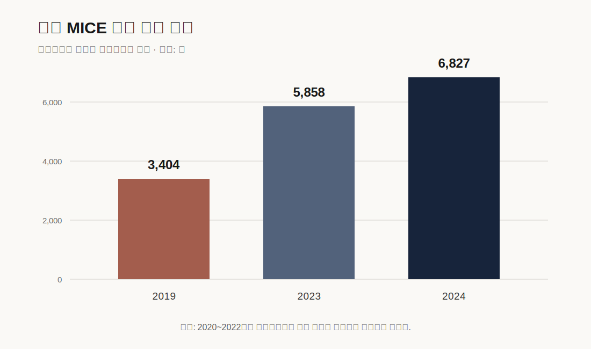

# 인천 개항장 B2B 로컬기프트 시장·정량근거

## 1. 결론

공개자료는 인천에 MICE·관광기관과 지역상품 정책기반이 존재함을 보여준다. 그러나 로컬기프트 발주액, 평균단가, 구매기관 수와 재주문율은 공개자료로 확인되지 않는다. 따라서 시장규모를 인구나 참가자 수로 계산하지 않고 잠재고객 20곳의 실제 구매업무·견적·발주로 검증한다.

## 2. 핵심 수치

| 지표 | 값 | 기준 | 해석 한계 |
|---|---:|---|---|
| 인천 MICE 행사 | 6,827건 | 2024 | 잠재 접점이며 선물 발주 건수 아님 |
| MICE 참가자 | 약 320만 명 | 2024 | 상품 구매자 수로 환산 금지 |
| 경제적 파급효과 | 약 1조 7천억원 | 2024 | 로컬기프트 시장규모 아님 |
| 코리아 마이스 엑스포 참가 | 약 3,000명 | 2024 | 단일 행사 사례 |
| 비즈니스 상담 | 약 4,000건 | 2024 | 로컬기프트 상담이 아님 |
| 인천 관광스타트업 | 15개사 내외 | 2026 | 공급지원 생태계 근거 |
| 기업별 사업화자금 | 최대 3,800만원 | 2026 | 선정·수령을 보장하지 않음 |
| 관광기념품 역대 수상작 DB | 1,978개 | 조회일 2026-07-15 | 상품유형·가격 벤치마크이며 수요 표본 아님 |
| 2025 관광기념품 최종 수상작 | 25개 | 2025 | 심사선정 사례이며 판매량·B2B 발주량 아님 |
| 관광기념품 구매실험 표본 | 3,203명·7개 실험 | 2025 | 중국의 시나리오 실험; 인천 수요로 일반화 금지 |
| 기념품 문헌고찰 분석대상 | 248편 | 1981~2020 | 국제 연구지형이며 국내 시장규모가 아님 |

원자료는 [인천 B2B 근거 CSV](data/incheon_b2b_evidence.csv)에 수록한다.

### 행사 개최 건수 비교

2020~2022년이 생략된 선택연도 비교다. 연속 시계열이나 로컬기프트 수요 그래프로 해석하지 않는다.

## 3. 자료가 지지하는 주장

- 인천에는 행사·MICE 운영사와 참가자 환대 업무가 존재한다.
- 인천관광 정책은 개항장을 문화관광 거점으로 육성하고 지역특화 상품을 과제로 둔다.
- 관광상품·굿즈와 가공식품을 판매하는 지역기업의 판로지원 사례가 있다.
- 관광스타트업과 관광·MICE 기업을 위한 지원체계가 존재한다.
- 관광기념품 연구는 지역문화 표현뿐 아니라 실용성·품질·휴대성·진정성과 구매맥락을 함께 다룬다.
- 한국관광공사 수상작 데이터베이스는 후보 상품군과 표시가격을 비교하는 벤치마크로 활용할 수 있다.

## 4. 자료가 지지하지 못하는 주장

- 행사 담당자가 기존 기념품에 불만족한다.
- 기관당 평균 주문은 30·50·100세트다.
- 세트당 3만~4만원의 지불의사가 있다.
- 개항장 상품이 일반 판촉물보다 선호된다.
- 지역 이야기가 재주문을 높인다.
- 접근 가능한 연간 시장규모가 얼마다.

이 주장은 구매담당자 인터뷰, 과거 발주서, 실제 견적과 유료주문 없이는 사용하지 않는다.

## 5. 시장규모 가설의 계산방법

TAM을 320만 명에 키트가격을 곱해 계산하지 않는다. 초기 SOM은 영업명단 기반으로 산정한다.

> 검증 SOM = 실제 접촉 가능한 구매기관 수 × 확인된 연간 행사횟수 × 확인된 평균 주문수량 × 실제 공급단가

12주 동안 각 변수에 실제값이 없으면 범위를 제시하지 않고 ‘미확인’으로 남긴다.

## 6. 추가 조사표

| 대상 | 반드시 확인할 수치 |
|---|---|
| 행사 운영사 | 연 행사수, 선물사용 비율, 평균수량·예산, 발주 리드타임 |
| 호텔 | 월 VIP·패키지 수량, 구매단가, 보관공간, 재주문주기 |
| 기업·대학 | 방문단·행사 횟수, 결재한도, 세금계산서·후불 조건 |
| 지역상점 | 공급가, MOQ, 주간생산량, 유통기한, 불량·대체조건 |

## 7. 공식 출처

1. 인천광역시(2025), [2024년 인천 MICE 통계](https://www.incheon.go.kr/IC010205/view?curPage=1&repSeq=DOM_0000000012371500)
2. 인천광역시(2024), [코리아 마이스 엑스포 성과](https://www.incheon.go.kr/IC010205/view?curPage=173&repSeq=DOM_0000000011115777)
3. 인천관광공사, [MICE 관련 조직업무](https://www.ito.or.kr/main/organization/organizationStaffList.do?staffAll=1)
4. 인천연구원(2026), [인천 정책로드맵 2040](https://www.ii.re.kr/base/linked/report/preview?atchSeq=1&boardNo=18583&div=A1&projcd=1024GH0065&seq=3)
5. 인천관광기업지원센터(2023), [관광상품·굿즈 팝업 입점 공고](https://tourbiz.ito.or.kr/info/notice/detail?noticeIdx=255)
6. 인천광역시·인천관광공사(2026), [인천 관광스타트업 모집](https://www.incheon.go.kr/IC010205/view?curPage=1&repSeq=DOM_0000000014270239)
7. 한국관광공사, [대한민국 관광공모전 기념품부문 역대 수상작](https://kto.visitkorea.or.kr/kor/souvenir/award/allAwardInfo.kto?lang=KOR)
8. 한국관광공사(2025), [관광기념품 공모전 최종 수상작 25개](https://kto.visitkorea.or.kr/kor/souvenir/news/noticeView.kto?searchId=371)
9. Shen, H. & Lai, I. K. W.(2022), [Souvenirs: A Systematic Literature Review](https://doi.org/10.1177/21582440221106734)
10. Huang, Q. et al.(2025), [How traditional cultural load affects tourists’ purchasing intention](https://doi.org/10.1371/journal.pone.0313905)
